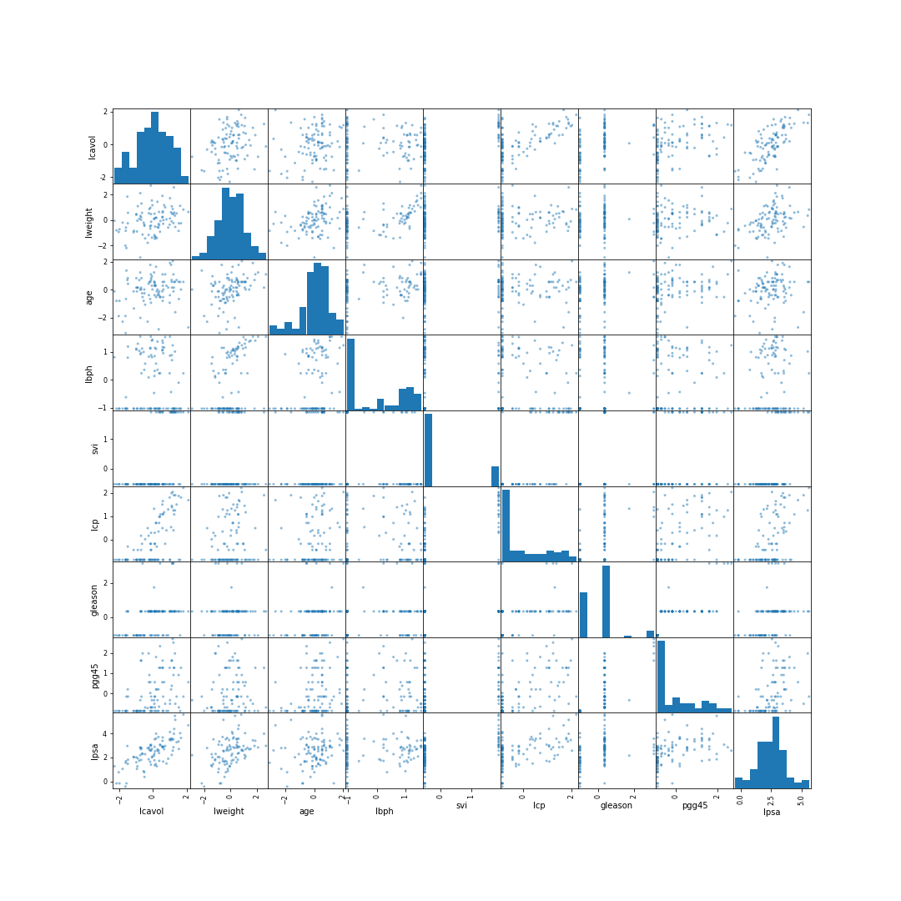
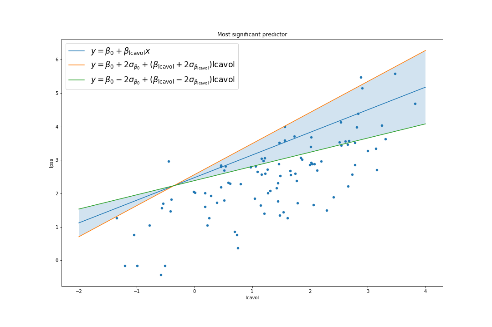
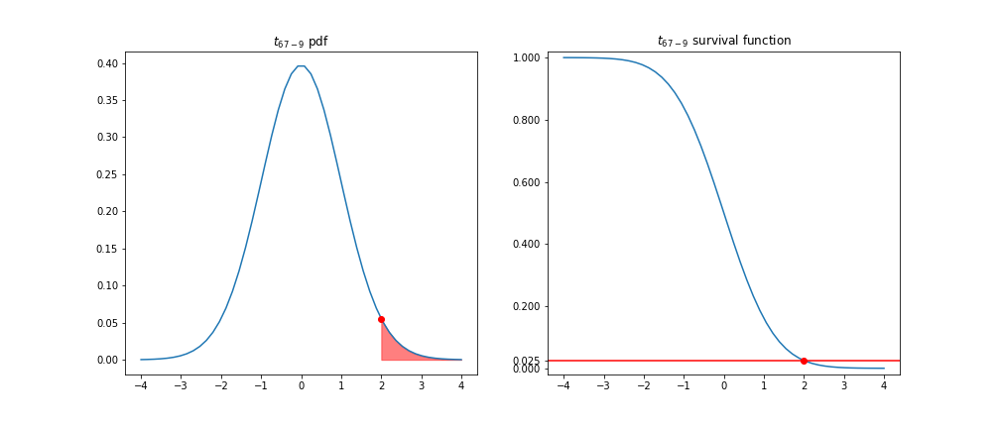
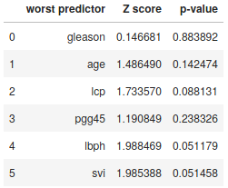
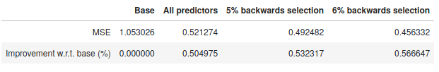

# Prostate Cancer (modelling lpsa levels)

Prostate specific antigen is useful as a preoperative marker for patients with prostate cancer [Stamey].
We use the dataset from [Hastie] (and [Stamey]) to model the dependence of the logarithm of prostate specific antigen (lpsa) on the given (8) predictors.
We use multilinear regression, and choose what predictors to keep using backwards stepwise selection.

## Main results and argument:

The univariate plots suggest a linear relationship between many of the predictors and the response.

Unsurprisingly, a multilinear model (using all the predictors) fits the data well, improving the base error (of the model which simply predicts the average) by 50.5%.  

(As explained in the IPYnotebook, the intercept is irrelevant in this graph: one must only observe the slope).

However, some of the predictors turn out to be superfluous.
Backwards selection tests the null-hypothesis using the Z-scores (which follow t-student distributions with 67-(p+1) d.o.f where p is the number of predictors) and provides a way to select the significant predictors.

Using backwards selection with a threshold of 5% on the p-value of the Z-scores actually improves our error on the test set: the base error is improved by 53.2%.  

Analyzing the Z-scores more carefully, one sees that it may actually be better to cap the p-values at 6% instead.

Indeed the resulting model (which drops the predictors gleason, age, lcp and pgg45) behaves the best, with an improvement of 56.7% w.r.t. the base error.

Here is a table with the errors for the different models:

## References:
- [Hastie]: 'The Elements of Statistical Learning' by Trevor Hastie et al.
- [Gareth]: 'Introduction to Statistical Learning' by Gareth James et al.
- [Casella]: 'Statistical Inference' by George Casella and Roger Berger.
- [Downey]: 'Think stats' by Allen Downey.
- [Stamey]: Stamey, Thomas A., et al. "Prostate specific antigen in the diagnosis and treatment of adenocarcinoma of the prostate. II. Radical prostatectomy treated patients." The Journal of urology 141.5 (1989): 1076-1083.
